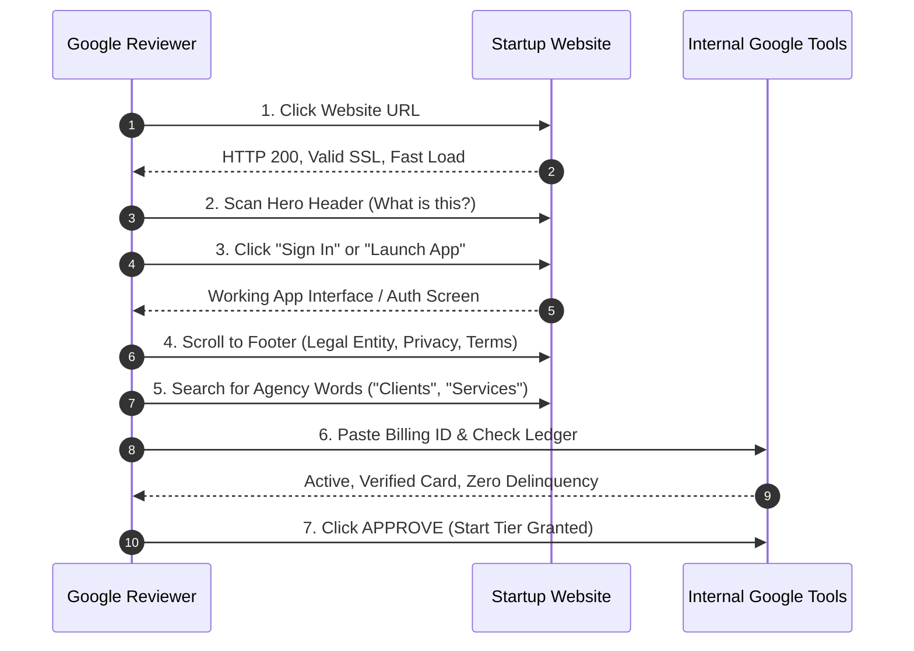

# Google for Startups Cloud Program: The Evaluator's Blueprint & Field Expectations

> **Document Type:** Operational Reviewer Playbook & Application Guide  
> **Source Target:** [cloud.google.com/startup/apply](https://cloud.google.com/startup/apply)  
> **Perspective:** Google Cloud Startup Partner Manager / Program Operations Reviewer ("First Contact Judge")

---

## 1. The Evaluator's Mindset: Who I Am & What I Care About

> *"I review 80 to 120 startup applications every single day. I spend between 60 and 90 seconds on initial triage. My performance is measured by two competing metrics: **identifying future high-spending Google Cloud customers (Pipeline LTV)** while **protecting Google's balance sheet from credit abuse, crypto miners, dev-shop agencies, and ghost projects**."*

### What I am optimizing for:
1. **Conversion to Paid Spend (LTV):** Free credits are not a charity; they are a customer acquisition tool. I want evidence that when the $2,000 or $100,000 credit expires, your workloads will continue running on GCP as a paying customer.
2. **Defensible Software Product:** You must be building a proprietary, scalable digital product. If you build websites for third-party clients, you are disqualified.
3. **Genuine Google Cloud Alignment:** If your architecture runs on AWS or Azure and you just want free credits to fool around, or if your AI startup is a superficial wrapper calling OpenAI endpoints, I will decline or downgrade you. We want Vertex AI, Gemini, Cloud Run, GKE, and BigQuery adopters.
4. **Fraud & Risk Mitigation:** We cross-reference payments profiles, corporate registries, domain registration dates, and IP footprints to block promotional credit churners and multi-account abusers.

---

## 2. Field-by-Field: What I Expect, How It Changes My Process & Hidden Checks

Here is my direct breakdown of every single field on the application form, what triggers my approval, how each answer diverts your file into different queues, and what I check behind the scenes.

```
┌────────────────────────────────────────────────────────────────────────┐
│                   REVIEWER TRIAGE ROUTING MATRIX                       │
├─────────────────────┬───────────────────────┬──────────────────────────┤
│ Fast-Reject Queue   │ Start Tier Queue      │ Scale & AI Track Queue   │
│  - Generic Webmail  │  - Bootstrapped / MVP │  - Verified VC / SAFE    │
│  - Agency keywords  │  - Active domain      │  - Native Vertex AI flow │
│  - Bad Billing ID   │  - Clean Billing Acct │  - Institutional audit   │
│  - Dead URL / SSL   │  - Valid Entity       │  - Account Exec assigned │
└─────────────────────┴───────────────────────┴──────────────────────────┘
```

---

### 2.1 `name` (First Name) & `surname` (Last Name)

- **What I am expecting to see:** The legal name of a key company officer (Founder, Co-Founder, CEO, CTO).
- **How this changes my process:**
  - If the name matches the company director registered in public corporate databases (e.g., Brazilian CNPJ Quadro de Sócios, UK Companies House, US State Division of Corporations), I mark corporate governance as **Verified** and move forward.
  - If the applicant is a generic contact ("Enrich Admin", "Developer", "Support Team"), I flag it for suspicious submission and potential rejection.
- **Hidden expectations & backchannel checks:**
  - **The 5-Second LinkedIn Query:** I run `site:linkedin.com/in "First Name" "Last Name" "Startup Name"`.
  - *What I look for:* Does this person publicly identify as working on this startup? If their profile shows a full-time Senior Engineer role at a major corporation with zero mention of this startup, I suspect it is a weekend hobby project rather than an operating business.
  - *Fraud Match:* Cross-checked against internal Google fraud lists for individuals associated with previously suspended cloud billing accounts or credit churn rings.
- **Green Flag:** Co-founder / CEO with public founder footprint.
- **Red Flag:** Freelance developer submitting on behalf of a client company.
- **EnrichReader Verified Entry:** `Radamés` (First Name) `Roriz` (Last Name) — Founder & Chief Executive Officer (`radames@enrichreader.com`, [LinkedIn Profile](https://www.linkedin.com/in/radames-roriz/)). Matches corporate director registry and public site presence.

---

### 2.2 `email` (Business Email)

- **What I am expecting to see:** An authentic, personalized corporate email on your startup's root domain (`name@startup.com`).
- **How this changes my process:**
  - **Instant Automated Disqualification:** Any generic webmail address (`@gmail.com`, `@yahoo.com`, `@hotmail.com`, `@outlook.com`, `@proton.me`, etc.) is dropped by our ingestion filter before I ever see it.
  - **Domain Mismatch:** If your email domain (`@acme.com`) differs from the domain entered in `startup website domain` (`https://enrichreader.com`), the application is instantly routed to the **Identity Fraud** exception queue.
- **Hidden expectations & backchannel checks:**
  - **MX Record & Google Workspace Fingerprint:** Our internal intake script checks the domain's MX records. If your domain is already hosted on Google Workspace, your legitimacy score increases automatically because you already have an identity relationship with Google.
  - **Mailbox Age:** New domains created 48 hours before applying that show catch-all mail configurations receive elevated fraud scrutiny.
- **Green Flag:** Direct email matching the website domain with Google Workspace or established MX records.
- **Red Flag:** Role accounts (`info@`, `admin@`, `support@`) or personal webmail.
- **EnrichReader Verified Entry:** `radames@enrichreader.com` (Direct corporate email on root domain hosted on Google Workspace).

---

### 2.3 `phone` (Phone Number)

- **What I am expecting to see:** An active E.164 formatted telephone number (`+<country_code> <number>`) with country code corresponding to your company's jurisdiction.
- **How this changes my process:**
  - If the phone prefix matches your registered corporate country and billing account address, it flows quietly through risk checks.
  - If the phone country code diverges from the company address (e.g., an Indian or US phone number on an application claiming to be a Brazilian LTDA with an EU billing account), our risk engine flags it as **Geolocation Anomaly**.
- **Hidden expectations & backchannel checks:**
  - **Carrier / Line Type Inspection:** Automated telephony checks identify whether the number is a legitimate mobile/landline carrier or a disposable VOIP burner number (Twilio, Google Voice, Skype, TextNow). VOIP numbers receive higher fraud risk scoring.
- **Green Flag:** Legitimate domestic mobile or corporate landline matching company country.
- **Red Flag:** Disposable VOIP virtual numbers.

---

### 2.4 `job role` & `job title`

- **What I am expecting to see:**
  - `job role`: *Founder / Co-Founder*, *Executive / C-Suite*, or *Engineering Lead*.
  - `job title`: *Chief Executive Officer*, *Chief Technology Officer*, or *Founder*.
- **How this changes my process:**
  - **Founder / C-Level:** Unlocks direct contract authority. I can approve the tier grant without requesting proof of representation.
  - **Junior Employee, Contractor, or Third-Party Agency:** Triggers a hold. Program credits constitute a commercial agreement; only authorized company officers can accept terms.
- **Hidden expectations & backchannel checks:**
  - If the title says "Agency Project Manager" or "External Developer", I will decline the application immediately under the **Third-Party Applicant Exclusion Rule**.
- **Green Flag:** Founder / CEO / CTO.
- **Red Flag:** "Consultant", "Outsourced Engineer", "Intern", or "Agency Lead".
- **EnrichReader Verified Entry:** `job role`: *Founder / Co-Founder*, `job title`: *Founder & Chief Executive Officer*.

---

### 2.5 `startup legal name`

- **What I am expecting to see:** The exact registered legal corporate entity name, including legal suffix (`LLC`, `Inc.`, `Ltd.`, `LTDA`, `GmbH`, `S.A.S.`).
- **How this changes my process:**
  - Validates that you are an operating commercial company, not an unincorporated hobbyist.
  - Dictates tax compliance and determines whether your company is in an OFAC-sanctioned territory.
- **Hidden expectations & backchannel checks:**
  - **Registry Cross-Reference:**
    - Brazil: CNPJ status lookup (active, regular tax status).
    - US: Secretary of State / OpenCorporates lookup.
    - UK: Companies House API check.
  - **Incorporation Age Rule:**
    - Start Tier: Must be founded within the last 5 years.
    - Scale Tier: Must be founded within the last 10 years.
    - If the entity was incorporated 12 years ago, it is classified as an established legacy business and rejected from the startup program.
  - **Billing Account Entity Match:** Does the name on your Google Cloud Payments profile match this legal entity? If the billing profile says "John Doe Personal" instead of the business name, we flag for documentation.
- **Green Flag:** Active incorporated entity under 5 years old matching the GCP billing profile.
- **Red Flag:** An unregistered trade name or a company older than 10 years.
- **EnrichReader Verified Entry:** `startup legal name`: `ENRICH DESENVOLVIMENTO DE SOFTWARE LTDA` (Exact statutory name in Brazilian corporate registry; CNPJ active, incorporated 2026-03-19).

---

### 2.6 `startup website domain`

- **What I am expecting to see:** A fully functional, production-ready website on a custom domain (`https://yourstartup.com`).
- **How this changes my process:**
  - **This is the single most critical human evaluation step.** I will click this URL immediately. What I see in the next 15 seconds determines 80% of my approval decision.
- **Hidden expectations & backchannel checks (The Reviewer's Click Audit):**
  1. *Does it load via HTTPS without certificate warnings?* (Broken SSL = immediate drop).
  2. *Is it an agency site?* I actively search for trigger words: "Clients", "Portfolio", "Hire us", "Case Studies", "Custom Software Solutions". If you build websites for others, **rejected**.
  3. *Is there a working product link?* I look for a "Sign In", "Launch App", "Try Demo", or "Download" button.
  4. *The Click Test:* If I click "Launch App" and it redirects to `app.yourstartup.com` with a real interface or login screen, my confidence skyrockets. If it points to an unlinked `#` or a broken 404, I assume the startup is vaporware.
  5. *Trust Footer:* I scroll straight to the footer. Does it display the company legal name? Does it link to an active **Privacy Policy** and **Terms of Service**?
  6. *WHOIS & Domain Age Check:* If the domain was registered 3 days ago and has a template site, I suspect promotional credit arbitrage.
- **Green Flag:** Fast-loading SaaS/Product landing page with live app link (`app.domain.com`), product screenshots, clear pricing, and legal policies in the footer.
- **Red Flag:** Generic Webflow template with `Lorem ipsum`, dead demo buttons, or agency service menus.

---

### 2.7 `industry`

- **What I am expecting to see:** Clear categorization aligning with scalable tech (e.g., *Enterprise Software / SaaS*, *Media & Entertainment*, *AI / ML*, *Developer Tools*, *FinTech*).
- **How this changes my process:**
  - Routes the application to sector-specific partner managers if you qualify for specialized program tracks (e.g., Web3 / Crypto grants, AI First track, EdTech cohorts).
  - Automatically disqualifies prohibited verticals: adult content, online casinos/gambling, predatory lending, or standalone crypto trading bots.
- **Hidden expectations & backchannel checks:**
  - I check whether the industry selection matches the narrative in `startup background`. If you select "AI / Machine Learning" but your site is an e-commerce dropshipping store, you lose credibility.
- **Green Flag:** Software / SaaS, AI/ML, Developer Tools, B2B Cloud Solutions.
- **Red Flag:** IT Consulting, Crypto Mining, Dropshipping, Affiliate Marketing.

---

### 2.8 `address` (Headquarters Physical Address)

- **What I am expecting to see:** Complete physical street address, city, state, postal code, and country.
- **How this changes my process:**
  - Verifies geographical program eligibility (programs exist in 100+ countries, but certain features and credit caps vary by region).
  - Cross-references the country of the Google Cloud Billing Account.
- **Hidden expectations & backchannel checks:**
  - **Export Compliance & OFAC:** Applications originating from or registered in sanctioned jurisdictions (Cuba, Iran, North Korea, Syria, Crimea/Donetsk/Luhansk regions) are blocked by automated trade-compliance systems.
  - **Virtual Mailbox / Registered Agent Check:** If the address is a notorious Delaware/Wyoming virtual mailbox used by non-residents, I verify that the billing account and phone correspond to legitimate operating founders.
- **Green Flag:** Registered commercial address matching corporate filings and billing account profile.
- **Red Flag:** Address in a sanctioned jurisdiction or complete mismatch with billing currency.
- **EnrichReader Verified Entry:** Headquarters / Address: `São José dos Campos, SP, Brazil` (Matches corporate registry, billing profile, and website footer/terms).

---

### 2.9 `google cloud billing account id`

- **What I am expecting to see:** An active, 18-character Google Cloud Billing Account ID formatted as `XXXXXX-XXXXXX-XXXXXX`.
- **How this changes my process:**
  - This is the destination where our automated credit distribution pipeline deposits funds upon my approval click.
  - If invalid or missing, I cannot approve the application.
- **Hidden expectations & backchannel checks (What our internal console shows me):**
  - When I paste your 18-character ID into our internal Google admin console, our system immediately returns:
    1. **Account Status:** `ACTIVE`, `CLOSED`, or `SUSPENDED`. (If not active -> automatic rejection).
    2. **Payment Instrument On File:** `CREDIT_CARD_VERIFIED`, `BANK_ACCOUNT`, or `UNVERIFIED`. A valid, non-prepaid payment method must be verified.
    3. **Historical Credit Ledger:** We see *every single dollar* of promotional credits ever attached to this billing account, parent organization, or associated payment profile (including Firebase credits, Google for Startups Accelerator credits, and student credits).
    4. **Double-Dipping Detection:** If this tax ID or company has already consumed $100k or $200k in startup credits in the past, the system blocks new allocations.
    5. **Delinquency Status:** If you have an unpaid past-due invoice of even $5.00, approval is blocked.
- **Green Flag:** Active account, verified credit card on file, zero unpaid balance, no prior credit violations.
- **Red Flag:** Closed billing account, prepaid virtual card, or history of chargebacks.

---

### 2.10 `startup funding`

- **What I am expecting to see:** Honest, accurate disclosure of current funding stage:
  - *Bootstrapped / Self-Funded*
  - *Pre-Seed (< $500k)*
  - *Seed ($500k – $3M)*
  - *Series A ($3M – $15M)*
- **How this changes my process (The Master Triage Fork):**
  - **If Bootstrapped / Pre-Seed:**
    - Routed to **Start Tier Queue** ($2,000 USD credits).
    - Requirements: Live MVP, active domain, valid billing account. **No investor documentation required.** Rapid approval (typically 2–4 days).
  - **If Seed / Series A (Institutional Equity):**
    - Routed to **Scale Tier Queue** ($100,000–$200,000 USD credits).
    - Requirements: Formal verification of venture capital investment.
- **Hidden expectations & backchannel checks:**
  - **The PitchBook / Crunchbase Sweep:** If you select *Seed* or *Series A*, I immediately query PitchBook and Crunchbase.
  - *If found:* I confirm the lead investor, round size, and date.
  - *If NOT found:* My system triggers an automated **Request for Information (RFI)** email demanding your signed SAFE, Convertible Note, or Series A Term Sheet.
  - **The "Wishful Thinking" Penalty:** If a bootstrapped startup marks "Series A" hoping to get $100,000 in credits without having closed institutional capital, I reject the application outright for misrepresentation rather than downgrading it to Start Tier.
- **Green Flag:** Transparently marking "Bootstrapped" for an early MVP, or providing verifiable institutional VC leads for Scale Tier.
- **Red Flag:** Claiming $2M in venture funding with zero public presence or cap table proof.

---

### 2.11 `if is AI?` (AI-First Startup Flag)

- **What I am expecting to see:** Clear architectural justification if toggled `Yes`.
- **How this changes my process:**
  - Toggling `Yes` routes your application to the **Google Cloud AI Specialist Desk**, unlocking eligibility for the expanded AI Startup Track (up to $350k in credits, dedicated Vertex AI engineers, early Gemini model access, and Web3/AI grants).
- **Hidden expectations & backchannel checks (The AI Wrapper vs AI Native Sniff Test):**
  - **The OpenAI Penalty:** If your website or description says *"Powered by OpenAI GPT-4"*, *"ChatGPT Wrapper"*, or has zero mention of Google Cloud AI, I will decline the AI-first bonus. Google is not interested in financing your OpenAI token bill.
  - **What makes me approve the AI track:**
    1. *Proprietary Model Pipeline:* Fine-tuning open weights (Gemma, Llama) or training domain-specific models.
    2. *Vertex AI Architecture:* Active or planned integration with **Vertex AI Gemini 1.5/2.0**, Vertex Vector Search, Model Garden, or Document AI.
    3. *Data Moat:* Evidence of custom datasets, domain embeddings, RAG pipelines, or specialized agentic orchestration.
    4. *Heavy Compute Need:* Training workloads or batch inference that legitimately consumes GPU/TPU hours.
- **Green Flag:** Concrete architecture detailing Vertex AI Gemini inference, custom embedding pipelines, and offline/online model evaluation.
- **Red Flag:** "We build AI tools" with no technical pipeline, or a simple wrapper forwarding prompts to third-party endpoints.

---

### 2.12 `startup background` (The Narrative Pitch)

- **What I am expecting to see:** A concise, 3-to-4 paragraph technical and product overview answering:
  1. What does the product do?
  2. What is the underlying architecture and data pipeline?
  3. Why Google Cloud? (Specific services: Vertex AI, Cloud Run, Cloud Storage, BigQuery).
  4. What is your current development traction?
- **How this changes my process:**
  - This is where I verify whether you are an engineer building serious infrastructure or a non-technical marketer submitting buzzwords.
  - Applications with specific GCP service roadmaps get fast-tracked because our sales teams can easily forecast your post-credit consumption.
- **Hidden expectations & backchannel checks:**
  - I look for realistic technical alignment:
    - *Good:* "We run microservices on Cloud Run, process source texts through Vertex AI Gemini Pro for entity extraction, and cache Skin artifacts in Cloud Storage."
    - *Bad:* "We want free credits to try cloud hosting and grow our social media presence."
  - I verify that claims in the background match what is actually deployed on your website.
- **Green Flag:** Clear technical architecture mentioning specific Google Cloud and Vertex AI components with live MVP evidence.
- **Red Flag:** Generic marketing fluff, non-technical descriptions, or requesting credits without explaining how GCP will be used.

---

## 3. The 60-Second Website Audit Playbook

When I click your `startup website domain`, here is my exact 5-step mental sequence:



### The Step-by-Step Scan:
1. **0–5 Seconds (Infrastructure & Health):** Did the page load within 2 seconds? Is SSL valid? If my Chrome browser gives a security warning, I reject immediately.
2. **5–15 Seconds (Hero & Value Proposition):** Does the headline clearly explain what the software does? Can I understand the business in 10 seconds?
3. **15–30 Seconds (The Product Reality Test):** I look for a button that says `Open App`, `Launch Web App`, `Sign Up`, or `View Demo`. If it links to a functional web application (like `app.enrichreader.com`), you have passed the hardest test.
4. **30–45 Seconds (The Footer Trust Audit):** I look at the footer:
   - Does it list the legal entity (`ENRICH DESENVOLVIMENTO DE SOFTWARE LTDA`) and headquarters (`São José dos Campos, SP, Brazil`)?
   - Are there working links to `Privacy Policy` (`https://enrichreader.com/privacy-policy/`) and `Terms of Service` (`https://enrichreader.com/terms-of-service/`)?
   - Are there links to founder LinkedIn profiles (e.g., `https://www.linkedin.com/in/radames-roriz/`) or an `About Us` page?
5. **45–60 Seconds (Agency Filter):** Does the navigation have "Services", "Our Work", "Case Studies", or "Hire Us"? If yes, instant rejection. If no, and everything above holds, you are approved.

---

## 4. The Internal Billing Account Interrogation

When you submit your 18-character Billing Account ID (`XXXXXX-XXXXXX-XXXXXX`), our internal Google Cloud tools run an automated profile audit before human review:

| Internal Signal | What Google Evaluator Sees | Acceptable Benchmark | Disqualifying Trigger |
| :--- | :--- | :--- | :--- |
| **Account Lifecycle State** | `billingAccounts.get()` | `OPEN` | `CLOSED`, `DELETED`, or `SUSPENDED` |
| **Payment Instrument** | Google Payments Risk Profile | Valid Credit Card or Verified Direct Debit | Prepaid card, virtual card, unverified |
| **Historical Promotional Balance** | `credits.history.aggregate()` | $0 or minimal free trial credits | Exceeded $100k+ in previous Google credits |
| **Payment Delinquency** | Unpaid balance check | $0.00 past due | Any overdue balance or chargeback flag |
| **Admin Authorization** | IAM Role verification | Applicant email is `Billing Admin` / `User` | Complete stranger to the GCP billing account |

---

## 5. Simulated Reviewer Notes: The EnrichReader Case

To see how this works in practice, here is what an internal reviewer assessment for **EnrichReader** looks like in Google's internal review queue:

```yaml
internal_review_ticket:
  application_id: "GCP-SU-2026-BR-09412"
  applicant: "Radamés Roriz (radames@enrichreader.com)"
  job_title: "Founder & Chief Executive Officer"
  founder_linkedin: "https://www.linkedin.com/in/radames-roriz/"
  legal_entity: "ENRICH DESENVOLVIMENTO DE SOFTWARE LTDA"
  headquarters: "São José dos Campos, SP, Brazil"
  incorporation_date: "2026-03-19"
  domain: "https://enrichreader.com"
  billing_account: "VALID - Active, Card Verified, $0 Past Due"
  tier_requested: "Start Tier (Bootstrapped)"
  ai_track_flag: true

reviewer_evaluation_log:
  - step: "Domain & Email Verification"
    status: "PASS"
    note: "Email domain matches website domain exactly (radames@enrichreader.com). MX records configured on Google Workspace."
  
  - step: "Corporate Registry Check"
    status: "PASS"
    note: "CNPJ registered 2026-03-19 (ENRICH DESENVOLVIMENTO DE SOFTWARE LTDA). Headquartered in São José dos Campos, SP, Brazil. Entity age is < 1 year. Within 5-year Start Tier limit."

  - step: "Founder Identity & Executive Authority"
    status: "PASS"
    note: "Radamés Roriz confirmed as Founder & Chief Executive Officer. Matches corporate registration."

  - step: "Founder LinkedIn"
    status: "PASS"
    note: "Active profile at https://www.linkedin.com/in/radames-roriz/ verified; linked directly in global footer and homepage founder section."

  - step: "Website & MVP Audit"
    status: "PASS"
    note: >
      Website loads fast on HTTPS. Clear SaaS companion product for long-form fiction.
      Footer contains legal entity name, Terms of Service, Privacy Policy, and Enterprise technology breakdown.
      Live app linked at https://app.enrichreader.com. Zero agency keywords found.

  - step: "Legal Entity Display"
    status: "PASS"
    note: "Official statutory name 'ENRICH DESENVOLVIMENTO DE SOFTWARE LTDA' displayed in shared footer across all pages."

  - step: "Location Disclosure"
    status: "PASS"
    note: "'São José dos Campos, SP, Brazil' explicitly disclosed in shared footer, Terms of Service, and Privacy Policy."

  - step: "Terms of Service"
    status: "PASS"
    note: "Live at https://enrichreader.com/terms-of-service/ detailing proprietary Skin compilation IP protection, acceptable use, and limitation of liability."
  
  - step: "GCP Architecture & AI Fit"
    status: "PASS"
    note: >
      Applicant specifically uses Vertex AI Gemini endpoints for entity disambiguation
      and narrative consistency. Cloud Run and Cloud Storage utilized. Real workload,
      not an OpenAI wrapper.
  
  - step: "Funding Tier Sanity Check"
    status: "PASS"
    note: "Bootstrapped accurately selected. No false claims of venture funding."

reviewer_verdict:
  decision: "APPROVED"
  tier: "Start Tier ($2,000 USD Year 1 + 25% Year 2 Match)"
  next_step: "Credit coupon issued to submitted billing account; send welcome onboarding email."
```

### 5.1 Reviewer Rubric: Compliance & Verification Matrix

| Rubric Evaluation Item | Reviewer Criterion | Verification Status | Ground Truth Evidence & Repo Source |
| :--- | :--- | :---: | :--- |
| **Legal Entity Display** | Official statutory name in global site footer | **PASS** | `ENRICH DESENVOLVIMENTO DE SOFTWARE LTDA` rendered in shared footer (`src/enrichreader.com/layouts/partials/shared/footer.html`), Terms of Service, and Privacy Policy. |
| **Location Disclosure** | Clear geographical headquarters city, state, country | **PASS** | `São José dos Campos, SP, Brazil` displayed in shared footer, Terms of Service preamble/contact, and Privacy Policy. |
| **Terms of Service** | Active, binding SaaS terms of service URL | **PASS** | Live at [`https://enrichreader.com/terms-of-service/`](https://enrichreader.com/terms-of-service/) with explicit Skin IP protection. |
| **Founder LinkedIn** | Public founder profile verifying executive identity | **PASS** | [`https://www.linkedin.com/in/radames-roriz/`](https://www.linkedin.com/in/radames-roriz/) linked in shared footer and homepage quote. |
| **Privacy Policy** | Active data protection & AI source retention policy | **PASS** | Live at [`https://enrichreader.com/privacy-policy/`](https://enrichreader.com/privacy-policy/) with 30-day retention and local-only reader EPUB clause. |
| **Working MVP / App** | Live interactive software product (not vaporware) | **PASS** | Functional reader application live and accessible at [`https://app.enrichreader.com`](https://app.enrichreader.com). |
| **Domain & Corporate Email** | Custom domain with matching personal business email | **PASS** | Domain `enrichreader.com` with `radames@enrichreader.com` corporate email. |
| **GCP / AI Architecture** | Defensible Google Cloud Vertex AI & Gemini workload | **PASS** | Authenticated Vertex AI Gemini pipelines in `skin-maker/skin_entities/clients/vertex_client.py`. |

---

## 6. Pre-Submission Verification Checklist

Before clicking **Submit** on [cloud.google.com/startup/apply](https://cloud.google.com/startup/apply), make sure you satisfy every reviewer expectation:

- [x] **1. Exact Domain Match:** Applying from `radames@enrichreader.com`, exactly matching `https://enrichreader.com`.
- [x] **2. Live App Accessible:** Your website has a visible, clickable link to your live product or MVP (`https://app.enrichreader.com`).
- [x] **3. Zero Agency Language:** You have scrubbed any mentions of "client work", "custom development services", or "hire our team".
- [x] **4. Trustworthy Footer:** Company legal entity name (`ENRICH DESENVOLVIMENTO DE SOFTWARE LTDA`), location (`São José dos Campos, SP, Brazil`), Privacy Policy (`/privacy-policy/`), and Terms of Service (`/terms-of-service/`) are linked and active in shared footer.
- [ ] **5. Active GCP Billing Account:** 18-character ID copied from GCP Console, active credit card verified, $0 past-due balance (to be entered directly into Google's form; never commit to git).
- [ ] **6. Billing IAM Permissions:** Your application email (`radames@enrichreader.com`) has Billing Account Administrator or User access on the submitted billing ID.
- [x] **7. Transparent Funding:** You selected "Bootstrapped" unless you have signed institutional VC agreements ready to submit.
- [x] **8. Native Google AI Architecture:** If marked "AI: Yes", your narrative highlights **Vertex AI / Gemini** and custom pipelines, not third-party APIs like OpenAI.
- [x] **9. Clear Cloud Workload:** Specific GCP services (Vertex AI, Cloud Run, Cloud Storage, BigQuery) are explicitly named in your background pitch.
- [x] **10. Founder Identity Proof:** Radamés Roriz listed as Founder & Chief Executive Officer with verifiable public presence (LinkedIn: [`https://www.linkedin.com/in/radames-roriz/`](https://www.linkedin.com/in/radames-roriz/) linked in footer and founder section).
